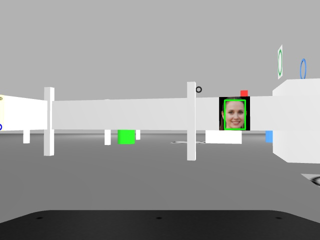
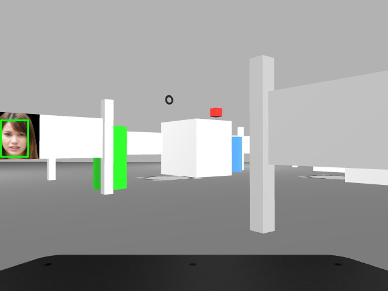
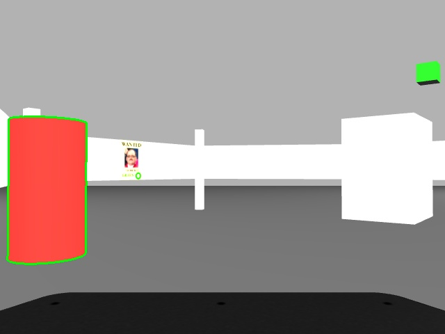
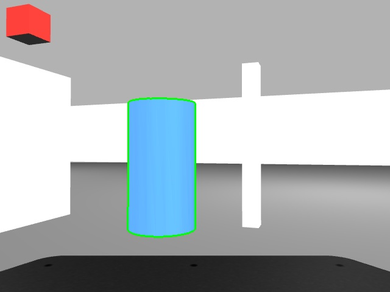
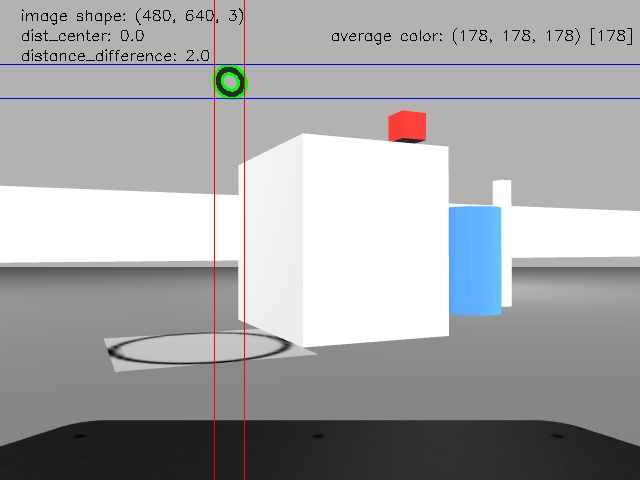
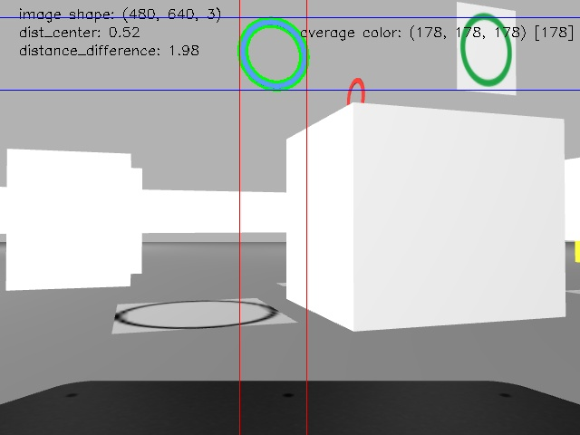

# RINS: project report

**Authors:** Blaž Bone, Nace Kovačič  
Fakulteta za računalništvo in informatiko, Univerza v Ljubljani

## Introduction

The project we undertook as part of the 2022/23 Development of Intelligent Systems class revolved around a challenging task of developing a robotic system referred to as the RoboSheriff. Our team was charged with designing, implementing, and testing a robot capable of interacting within a simulated environment stylized as a "Small Wild West City" scene. This was an extensive project with diverse objectives, encapsulating the competencies developed during the first two tasks and pushing the boundaries even further by building on top of them.

The core challenge was to enable the robot to identify and locate a “robber” within the simulated environment, a task that entailed several sub-objectives. The robot was required to recognize different entities within the scene including human faces, "Wanted" posters, and cylinders of different colors. It also needed to identify specific parking slots, indicated by rings of different sizes and colors. The enviroment also included objects that could have been misinterpreted, making it necessary to use as robust methods as possible.

Once the entities were recognized, the robot was tasked to perform a series of actions in a particular sequence. It had to locate all the people in the city, identify from the posters which robber it was supposed to apprehend, engage in a simple dialogue with the people to gather information on the potential location of the robber, and search the top of the buildings for the robber. Upon locating the robber, the robot was required to "imprison" him by taking him to a specific building identified as the prison, and finally park itself in front of this building.

This project presented an opportunity for our team to apply a range of methods and techniques within the realm of intelligent systems, such as face recognition, image detection, autonomous navigation, and simple dialogue implementation. The techniques used were also taught in Machine Perception and Intelligent Systems class, combining the subjects beautifully. 

It also posed an array of challenges relating to the integration of different components within the Robot Operating System. Through this report, we present a detailed description of our approach, the methods applied, and the overall performance of the system that we developed for the third competition.

## Methods

### Face detection
The face recognition process in our code is primarily handled through a Deep Neural Network (DNN) using OpenCV. We used a pre-trained DNN model that is known for its performance in image recognition tasks. These models have been trained on large datasets of faces, enabling them to recognize a wide variety of faces in different lighting conditions, orientations, and expressions.

In our code, we use the function `cv2.dnn.blobFromImage` to prepare the image for input into the DNN. This function resizes and normalizes the image. We resize the image to 300x300 pixels and perform normalization by subtracting mean RGB values to reduce illumination differences in the image. This blob is then fed into the DNN using `self.face_net.setInput(blob)`.

The network analyzes the blob and returns detections using `self.face_net.forward()`. Each detection includes a bounding box, which represents the coordinates of the detected face in the image, as well as a confidence score indicating the certainty of the detection.

For each detection, we filter out ones with a confidence score lower than 0.50 to reduce false positives. Additionally, we ensure that the detected face's aspect ratio falls within an expected range, which helps us disregard detections that don't resemble a typical face shape or faces that were seen from too narrow of an angle.

Our face recognition system doesn't stop at detecting faces in the current frame. We also maintain a history of faces we have encountered. When we detect a face, we calculate its position in 3D space using depth information from the depth camera. We then match this new detection against previously seen faces based on their positions in the map. If the detected face is deemed to be a new face (i.e., it doesn't match any previously seen faces within a certain threshold), we add the face to our history with its associated data. If it matches a previously seen face, we update the corresponding historical data with the new detection's data.

In conclusion, our face recognition system combines a DNN for image-based face detection with depth information for tracking faces in 3D space over time. This multimodal approach allows for a more robust and versatile face recognition system.

### Cylinder detections
Our approach to detecting cylinders in an image is multi-staged, combining image processing techniques with object shape characteristics. 

We start by converting the image from the standard RGB color space to HSV (Hue, Saturation, Value), which is more similar to how our human vision perceives color-making attributes. 

Following this, we employ a technique called color masking. Color masks are binary images of the same size as our original image. Each pixel of the mask is set to either black or white depending on whether its corresponding pixel in the original image matches a certain color range. In our case, we define the color ranges for red, green, blue, and yellow (colors of cylinders) in the HSV space. 

For each detected color, we create a mask, identifying the regions in the image that are of that particular color. We calculate the percentage of the total pixels that each color occupies. The color with the highest occupancy percentage is retained for further processing.

To ensure that we are detecting cylinders, we consider the spatial distribution of the color in the image. A standing cylinder, from a certain perspective, will appear more at the bottom of an image than the top. We create a "progressive mask" that prioritizes the lower part (cylinders are always on the ground) of the image based on the percentage of color occupancy. We then apply this mask to our image. This gives us a bottom-masked color mask. If there are any non-zero pixels in this bottom-masked color mask, we proceed with the assumption that the color comes from a cylindrical object.

Once we are confident that we have a potential cylinder, we find the contours of the detected color region. Contours are simply the boundaries of an object. Once we have the contours, we approximate them to a polygonal curve. This is done to reduce the complexity of the contour while preserving its structural shape. 

A typical characteristic of a cylindrical object is that it will appear as a rectangle in an image when viewed from the side or from afar. A rectangle can be represented as a four-sided polygon in two dimensions. Hence, if our approximated polygon has four sides, and the angles are close to 90 degrees, we have a good reason to believe that the object is cylindrical. This assumption holds especially true because there are no real rectangles on the map.

If a detection passes all the checks, we calculate the centroid, which will be used as the detected location of the cylinder. We also calculate the depth of the detected cylinder in the scene, which can provide information about the cylinder's distance from the camera and its space on the map.

In conclusion, we leverage color information, spatial distribution, and geometric properties to detect and localize cylinders in an image. This method is a robust approach, allowing us to recognize cylinders of different colors in various scenarios.

### Ring detection

Our ring detection approach combines various techniques to accurately identify and locate rings in the scene. The process begins by retrieving an RGB image and converting it to grayscale. Histogram equalization is applied to enhance contrast. Adaptive thresholding is then performed to create a binary image.

Contours are extracted from the binary image, representing the boundaries of the detected objects. Ellipses are fitted to these contours, and candidate concentric ellipse pairs are identified based on their proximity.

To validate a candidate pair as a ring, several checks are performed, including distance differences and average color range. If a candidate pair passes these checks, further calculations are conducted.

The larger ellipse's size and center are determined, and a region of interest is extracted from the original color image. The average color within the region of interest is extracted using a mask. K-means clustering is applied to the region of interest to extract the main colors present in the region.

Using depth information, the pose of the detected ring and associated greeting position are obtained. The location and greeting position data are stored in a dictionary, categorized by the ring's main color. Existing data is updated if rings of the same color are detected.

Our approach leverages image processing, ellipse fitting, depth analysis, and color recognition techniques to achieve robust ring detection. By combining information from the color image and depth image, our method enables accurate detection even in complex scenarios.

### Text detection and recognition

Our text detection and recognition process utilizes libraries such as `pytesseract` and `EasyOCR` to perform text recognition.

In the `is_poster` function, an RGB image is captured from the camera. The image is processed using the `pytesseract` and `EasyOCR` libraries to extract text. The extracted text is then passed to the `extract_information` function to obtain reward and color information.

In the `extract_information` function, the input text is processed to extract numerical information and identify the dominant color. The text is cleaned by removing spaces and empty lines. Numerical values are extracted by filtering out non-digit characters and converting the resulting strings to integers. The highest numerical value is considered the reward. The function also identifies the dominant color by searching for specific color keywords in the text.

Our approach combines text recognition algorithms and preprocessing techniques to accurately extract information from the image. The use of multiple text recognition libraries enhances the accuracy and reliability of the information extraction process.

### Speech Recognition

Our speech recognition module enables the robot to interact with people on the map using spoken language. It utilizes the SpeechRecognition library to convert speech into text.

The robot initiates a conversation by asking the person, "Do you know where the robber is?" Using a microphone as the audio source, the person's response is captured and processed.

The recognized text is then analyzed, searching for specific color keywords related to the robber's location. If any colors are found, they are recorded as possible locations.

This speech recognition module allows for effective communication between the robot and humans, enabling the robot to gather information about the robber's whereabouts.

### Movement

In our robot's movement, it is important to note that we have not implemented autonomous navigation. Instead, we have predefined and hard-coded paths for the robot to follow based on its current task. We defined waypoints in the scene that the robot visits sequentially, simulating autonomous movement.

The robot's position is obtained from the odometry information provided by the simulator. Using this information, we can calculate the direction and distance to the next waypoint. We apply a simple proportional controller to adjust the robot's linear and angular velocity based on the error between its current position and the desired position.

The robot moves towards the next waypoint until it reaches a certain proximity threshold. It then proceeds to the next waypoint in the predefined path. This approach allows us to control the robot's movement accurately and ensure that it follows the desired trajectory.

## Results

Our RoboSheriff demonstrated satisfactory performance in the third competition task. It successfully completed the objectives of identifying and locating the robber within the simulated environment, engaging in dialogue with people to gather information, and executing the required actions in the correct sequence.

The face recognition module effectively detected and tracked faces in the scene. It was capable of recognizing previously encountered faces and updating their positions based on depth information. This provided reliable data for face-based interactions.

The cylinder detection module accurately identified and located cylinders of different colors. It employed color masking, spatial distribution analysis, and shape properties to distinguish cylinders from other objects. The detection results were reliable, allowing the robot to interact with the cylinders as required.

The ring detection module successfully identified rings and extracted their color and position information. By combining image processing techniques, ellipse fitting, and color recognition, the module achieved robust ring detection in various scenarios.

The text detection and recognition module effectively extracted information from "Wanted" posters, including rewards and dominant colors. It accurately recognized and processed the text, providing the necessary data for the robot's decision-making process.

The speech recognition module enabled the robot to communicate with people in the scene. It converted spoken language into text and extracted relevant information about the robber's possible locations based on color keywords. This facilitated efficient interactions and helped the robot gather valuable information.

The robot's movement was implemented using predefined paths and a simple proportional controller. While not autonomous, the movement system accurately followed the desired trajectories and reached the designated waypoints within acceptable proximity.

Overall, our RoboSheriff demonstrated a satisfactory performance in the third competition task. It successfully fulfilled the objectives and showcased the integration of various intelligent systems components within the Robot Operating System.

## Conclusion

The development of the RoboSheriff for the third competition task challenged us to integrate and extend our knowledge in different areas of intelligent systems. We successfully implemented modules for face recognition, cylinder detection, ring detection, text detection and recognition, speech recognition, and movement control. By combining these components, our RoboSheriff was able to identify and locate the robber, engage in dialogue with people, and execute the required actions in the correct sequence.

Throughout the project, we faced various challenges, including fine-tuning parameters, dealing with lighting and perspective variations, and ensuring robustness in detection and recognition tasks. However, by employing a combination of image processing techniques, machine learning algorithms, and depth analysis, we were able to overcome these challenges and achieve satisfactory performance.

The project provided valuable hands-on experience in developing and integrating intelligent systems components using the Robot Operating System. It allowed us to apply the concepts and techniques learned throughout the course in a practical and challenging context.

While our RoboSheriff demonstrated satisfactory performance, there is room for further improvement. Future work could involve refining the algorithms and parameters for more robust and accurate detection and recognition. Additionally, the integration of autonomous navigation and path planning could enhance the robot's overall capabilities and autonomy.

In conclusion, the project was a valuable learning experience, allowing us to apply and extend our knowledge in the field of intelligent systems. We gained practical insights into the development of complex robotic systems and their integration within a simulated environment.