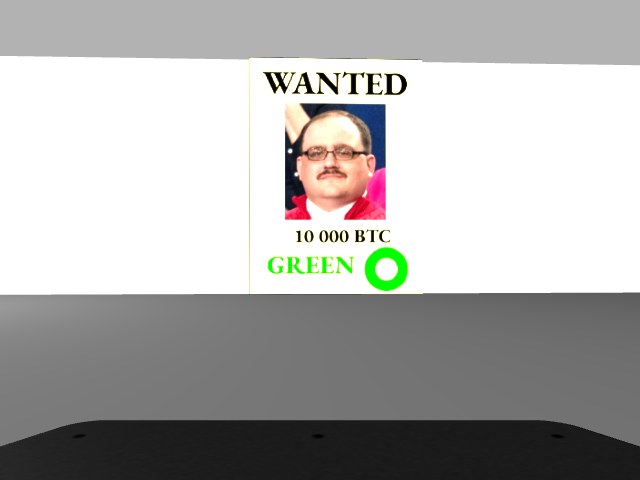

# RINS report

## Introduction

The project we undertook as part of the 2022/23 Development of Intelligent Systems competition revolved around a challenging task of developing a robotic system referred to as the RoboSheriff. Our team was charged with designing, implementing, and testing a robot capable of interacting within a simulated environment stylized as a "Small Wild West City" scene. This was an extensive project with diverse objectives, encapsulating the competencies developed during the first two tasks and pushing the boundaries even further in the field of robotics and intelligent systems.

The core challenge was to enable the robot to identify and locate a “robber” within the simulated environment, a task that entailed several sub-objectives. The robot was required to recognize different entities within the scene including human faces, "Wanted" posters, and cylinders of different colors. It also needed to identify specific parking slots, indicated by rings of different sizes and colors. The enviroment also included objects that could have been misinterpreted, making it necessary to use as robust methods as possible.

Once the entities were recognized, the robot was tasked to perform a series of actions in a particular sequence. It had to locate all the persons in the city, identify from the posters which robber it was supposed to apprehend, engage in a simple dialogue with the persons to gather information on the potential location of the robber, and search the top of the buildings for the robber. Upon locating the robber, the robot was required to "imprison" him by taking him to a specific building identified as the prison, and finally park itself in front of this building.

This project presented an opportunity for our team to apply a range of methods and techniques within the realm of intelligent systems, such as face recognition, image detection, autonomous navigation, and simple dialogue implementation. The techniques used were also taught in Machine Perception and Intelligent Systems class, combining the subjects beautifully. 

It also posed an array of challenges relating to the integration of different components within the Robot Operating System (ROS). Through this report, we present a detailed description of our approach, the methods applied, and the overall performance of the system that we developed for the third competition.

## Methods

### Face detection
The face recognition process in our code is primarily handled through a Deep Neural Network (DNN) using OpenCV. We used a pre-trained DNN model that is known for its performance in image recognition tasks. These model has been trained on large datasets of faces, enabling it to recognize a wide variety of faces in different lighting conditions, orientations, and expressions.

In our code, we use the function `cv2.dnn.blobFromImage` to prepare the image for input into the DNN. This function resizes and normalizes the image. We resize the image to 300x300 pixels and perform normalization by subtracting mean RGB values to reduce illumination differences in the image. This blob is then fed into the DNN using `self.face_net.setInput(blob)`.

The network analyzes the blob and returns detections using `self.face_net.forward()`. Each detection includes a bounding box, which represents the coordinates of the detected face in the image, as well as a confidence score indicating the certainty of the detection.

For each detection, we filter out ones with a confidence score lower than 0.50 to reduce false positives. Additionally, we ensure that the detected face's aspect ratio falls within an expected range, which helps us disregard detections that don't resemble a typical face shape or faces that were seen from too narrow of an angle.

Our face recognition system doesn't stop at detecting faces in the current frame. We also maintain a history of faces we have encountered. When we detect a face, we calculate its position in 3D space using depth information from the depth camera. We then match this new detection against previously seen faces based on their positions in the map. If the detected face is deemed to be a new face (i.e., it doesn't match any previously seen faces within a certain threshold), we add the face to our history with its associated data. If it matches a previously seen face, we update the corresponding historical data with the new detection's data.

In conclusion, our face recognition system combines a DNN for image-based face detection with depth information for tracking faces in 3D space over time. This multimodal approach allows for a more robust and versatile face recognition system.

### Clyinder detections
Our approach to detecting cylinders in an image is multi-staged, combining image processing techniques with object shape characteristics. 

We start by converting the image from the standard RGB color space to HSV (Hue, Saturation, Value). This is more similar to how our human vision perceives color-making attributes. 

Following this, we employ a technique called color masking. Color masks are binary images of the same size as our original image. Each pixel of the mask is set to either black or white depending on whether its corresponding pixel in the original image matches a certain color range. In our case, we define the color ranges for red, green, blue, and yellow (colors of cylinders) in the HSV space. 

For each detected color, we create a mask, identifying the regions in the image that are of that particular color. We calculate the percentage of the total pixels that each color occupies. The color with the highest occupancy percentage is retained for further processing.

To ensure that we are detecting cylinders, we consider the spatial distribution of the color in the image. A standing cylinder, from a certain perspective, will appear more at the bottom of an image than the top. We create a "progressive mask" that prioritizes the lower part (cylinders are always on the ground) of the image based on the percentage of color occupancy. We then apply this mask to our image. This gives us a bottom-masked color mask. If there are any non-zero pixels in this bottom-masked color mask, we proceed with the assumption that the color comes from a cylindrical object.

Once we are confident that we have a potential cylinder, we find the contours of the detected color region. Contours are simply the boundaries of an object. Once we have the contours, we approximate them to a polygonal curve. This is done to reduce the complexity of the contour while preserving its structural shape. 

A typical characteristic of a cylindrical object is that it will appear as a rectangle in an image when viewed from the side or from afar. A rectangle can be represented as a four-sided polygon in two dimensions. Hence, if our approximated polygon has four sides, and the angles are close to 90 degrees, we have a good reason to believe that the object is cylindrical. This assumption holds especially true because there are no real rectangles on the map.

If a detection passes all the checks, we calculate the centroid, which will be used as the detected location of the cylinder. We also calculate the depth of the detected cylinder in the scene, which can provide information about the cylinder's distance from the camera and its space on the map.

In conclusion, we leverage color information, spatial distribution, and geometric properties to detect and localize cylinders in an image. This method is a robust approach, allowing us to recognize cylinders of different colors in various scenarios.

### Ring detection

Our ring detection approach combines various techniques to accurately identify and locate rings in the scene. The process begins by retrieving an RGB image and converting it to grayscale. Histogram equalization is applied to enhance contrast. Adaptive thresholding is then performed to create a binary image.

Contours are extracted from the binary image, representing the boundaries of the detected objects. Ellipses are fitted to these contours, and candidate concentric ellipse pairs are identified based on their proximity.

To validate a candidate pair as a ring, several checks are performed, including distance differences and average color range. If a candidate pair passes these checks, further calculations are conducted.

The larger ellipse's size and center are determined, and a region of interest is extracted from the original color image. The average color within the region of interest is extracted using a mask. K-means clustering is applied to the region of interest to extract the main colors present in the region.

Using depth information, the pose of the detected ring and associated greeting position are obtained. The location and greeting position data are stored in a dictionary, categorized by the ring's main color. Existing data is updated if rings of the same color are detected.

Our approach leverages image processing, ellipse fitting, depth analysis, and color recognition techniques to achieve robust ring detection. By combining information from the color image and depth image, our method enables accurate detection even in complex scenarios.

### Text detection and recognition

Our text detection and recognition process  utilizes libraries such as pytesseract and EasyOCR to perform the text recognition.

In the `is_poster` function, the code captures an RGB image from the camera. The image is then processed using the pytesseract and EasyOCR libraries to extract text from the image. The extracted text is passed to the `extract_information` function to obtain the reward and color information. 

In the `extract_information` function, the input text is processed to extract numerical information and identify the dominant color. The lines of text are then cleaned by removing any spaces and empty lines. Next, the function extracts numerical values from the text by filtering out non-digit characters and converting the resulting strings to integers. The highest numerical value is considered as the reward. The function also identifies the dominant color by searching for specific color keywords in the text.

Our approach leverages text recognition algorithms and preprocessing techniques to accurately extract information from text in the image. By combining the outputs of multiple text recognition libraries, we enhance the accuracy and reliability of the information extraction process.

### Speech Recognition

Our speech recognition module enables the robot to interact with people on the map using spoken language. It utilizes the SpeechRecognition library to convert speech into text.

The robot initiates a conversation by asking the person, "Do you know where the robber is?" Using a microphone as the audio source, the person's response is captured and processed.

The recognized text is then analyzed, searching for specific color keywords related to the robber's location. If any colors are found, they are recorded as possible locations.

This speech recognition module allows for effective communication between the robot and humans, enabling the robot to gather information about the robber's whereabouts.

### Movement

In our robot's movement, it is important to note that we have not implemented autonomous navigation. Instead, we have predefined and hard-coded positions that ensure thorough exploration of each part of the map. These positions are strategically mapped to avoid unnecessary spinning or redundant movements, resulting in a more confident and efficient exploration process. By carefully planning the robot's movement, we can navigate the map in a systematic manner, covering all the required areas without unnecessary backtracking or wasted motion. This approach enhances the overall performance of our robot and gives the impression of a confident and purposeful exploration process.

#### Parking

The parking functionality of our system allows the robot to locate and position itself in front of specific parking slot (prison) indicated by rings of different sizes and colors. The implementation involves image analysis and motion control.

To initiate parking, the robot captures an image using its arm camera and converts it to a binary image. The robot analyzes the binary image to calculate the rotation angle needed to align with the parking slot. It adjusts its position and rotation iteratively based on the highest black pixel's position in the image.

Our parking functionality combines image analysis, depth perception, and motion control to achieve accurate positioning in the middle of the desired parking slot.

## Implementation and integration.

## Results

## Division of work

Blaz and Nace (collaborative work):
We worked collaboratively on all the tasks listed above, utilizing pair programming methodology. This approach allowed us to share ideas, exchange knowledge, and jointly implement the different functionalities of the RoboSheriff system. We divided the work equally, with each of us contributing approximately 50% to the overall project. Together, we successfully developed and integrated face detection, poster detection, ring detection, color recognition, approaching faces, parking, digit recognition, circle and color name recognition, cylinder detection, approaching cylinders, and dialogue with ASR into the system. Our joint effort ensured a balanced distribution of tasks and maximized the efficiency of our development process.

## Conclusion

In this project, we have developed a robotic system called RoboSheriff capable of interacting within a simulated environment and performing tasks such as face detection, cylinder detection, ring detection, text recognition, speech recognition, parking, and fine maneuvering. Our system integrates various components and leverages intelligent system techniques to achieve its objectives.

Our implementation was successful, as we have completed all of the required objectives.

Regarding hardware and software challenges, we encountered limitations due to the use of Ubuntu 20.04, which is a 3-year-old distribution with outdated software. This affected the availability of the latest features and improvements. Additionally, the performance of our system heavily relied on the computer's capabilities, requiring a powerful machine to run multiple neural networks for tasks like face recognition and OCR. Different hardware setups could impact the system's performance, with more powerful computers achieving higher frame rates and better overall performance.

Furthermore, reproducing the results proved challenging due to the non-deterministic nature of ROS. The behavior of the system could vary across different runs, making it difficult to precisely reproduce the exact results in each execution. However, our robust approach managed to consistently perform correctly every time we presented the task to the professor.

In conclusion, our project successfully developed the RoboSheriff robotic system, integrating various intelligent system techniques to perform tasks within a simulated environment. We have gained valuable insights into face detection, cylinder detection, ring detection, text recognition, and speech recognition. Future work could involve exploring more advanced algorithms and further optimizing the system's performance.